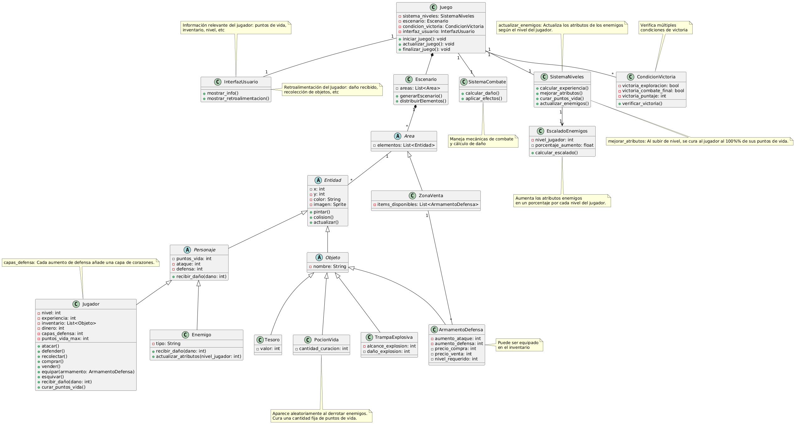

# Taller Videojuegos

 


- ver [badgen](https://badgen.net/) o [shields](https://shields.io/) para otros tipos de _badges_

## Autor

- [@cristian1231a](https://github.com/cristian1231a)
- [@DanielAngul0](https://github.com/DanielAngul0) 

## Descripción del Proyecto

Este proyecto consiste en el desarrollo de un videojuego básico utilizando los principios de la **Programación Orientada a Objetos** (POO). Los estudiantes crearán un mundo de juego interactivo donde los jugadores pueden controlar un personaje, explorar escenarios, interactuar con objetos y enemigos, y progresar a través de la historia. El juego se diseñará para enfatizar los conceptos de **POO**, como clases, objetos, herencia, polimorfismo y encapsulamiento. A través de este proyecto, los estudiantes aplicarán sus conocimientos de POO para construir un sistema modular y extensible, sentando las bases para proyectos de software más complejos en el futuro.

El proyecto se dividirá en varias fases, comenzando con la creación de clases para personajes, enemigos y objetos, y luego avanzando hacia la implementación de la lógica del juego, el sistema de combate y la interfaz de usuario básica. Se fomentará el uso de buenas prácticas de programación, como la documentación del código, el control de versiones con Git. Al finalizar el proyecto, los estudiantes habrán ganado experiencia práctica en el diseño y desarrollo de software orientado a objetos, así como en la resolución de problemas y el trabajo en equipo.

#### Objetivos del Proyecto

1.  Aplicar los principios de la programación orientada a objetos (POO), demostrando su capacidad para diseñar e implementar clases, objetos, herencia, polimorfismo y encapsulamiento en el contexto del desarrollo de un videojuego.
2.  Desarrollar un sistema modular y extensible, de manera que sea fácil de modificar y expandir, permitiendo la adición de nuevas funcionalidades y contenido en el futuro.
3.  Implementar la lógica del juego y el sistema de combate funcional y equilibrado, así como la lógica para la interacción con objetos y enemigos en el mundo del juego.
4.  Crear una interfaz de usuario básica que permita al jugador interactuar con el mundo del juego y visualizar la información relevante (puntos de vida, inventario, etc.).
5.  Practicar buenas prácticas de programación como el control de versiones (Git), documentar su código.

## Requerimientos

* **R1.1. Creación de Personaje Jugable**: El sistema debe permitir la creación de un personaje jugable con los siguientes atributos: Puntos de vida, Ataque, Defensa, Nivel, Inventario.

* **R1.2. Creación de Enemigos**: El sistema debe permitir la creación de enemigos con los siguientes atributos: Puntos de vida, Ataque, Defensa, Tipo ("volador", "terrestre").

* **R2.1. Creación de Trampas Explosivas**: El sistema debe permitir la creación de trampas explosivas con atributos de: Alcance de explosión, Daño por explosión.

* **R2.2. Creación de Tesoros**: El sistema debe permitir la creación de tesoros con un atributo de: Valor monetario.

* **R2.3. Creación de Armamento/Defensa**: El sistema debe permitir la creación de objetos de armamento y defensa con atributos de: Aumento de ataque/defensa, Precio de compra/venta.

* **R3.1. Interacción de Combate**: El personaje debe poder atacar y defenderse de los enemigos.

* **R3.2. Recolección de Objetos**: El personaje debe poder recolectar trampas explosivas y tesoros.

* **R3.3. Interacción con Armamento/Defensa**: El personaje debe poder comprar, usar y vender objetos de armamento y defensa.

* **R3.4. Interacción con el Entorno**: El personaje debe poder recolectar objetos y esquivar obstáculos dentro del escenario.

* **R4.1. Generación del Escenario**: El sistema debe generar un escenario desconocido con diferentes áreas explorables.

* **R4.2. Distribución de Elementos**: El sistema debe ubicar aleatoriamente enemigos y objetos dentro del escenario.

* **R4.3. Zonas de Venta**: El sistema debe incluir zonas de venta donde el personaje pueda comprar armamento y mejoras.

* **R5.1. Mecánica de Combate**: El sistema debe implementar un sistema de combate que permita el ataque y la defensa entre el personaje y los enemigos.

* **R5.2. Cálculo de Daño**: El sistema debe calcular el daño infligido en base a los atributos de ataque, defensa y puntos de vida.

* **R5.3. Efectos Especiales**: El sistema debe generar efectos especiales basados en el tipo de ataque y la interacción entre objetos (ej: explosión de trampas).

* **R6.1. Sistema de Experiencia y Nivel**: El personaje debe ganar experiencia al derrotar enemigos y recolectar objetos valiosos, lo que lleva al aumento de nivel.

* **R6.2. Mejora de Atributos**: El sistema debe permitir la mejora de los atributos del personaje (puntos de vida, ataque, defensa) al subir de nivel.

* **R6.3. Acceso a Nuevo Equipamiento**: El sistema debe permitir el acceso a nuevo armamento y defensas a medida que el personaje avanza de nivel.

* **R7.1. Victoria por Exploración**: El juego debe tener una condición de victoria al completar la exploración del mapa del juego.

* **R7.2. Victoria por Combate Final**: El juego debe tener una condición de victoria al derrotar a un jefe final.

* **R7.3. Victoria por Puntaje:**: El juego debe tener una condición de victoria al alcanzar un puntaje determinado.

* **R8.1. Interfaz de Usuario (UI)**: sistema debe proporcionar una interfaz de usuario intuitiva y fácil de usar que muestre información relevante al jugador (puntos de vida, inventario, nivel, etc.).

* **R8.2. Retroalimentación del Jugador**: El sistema debe proporcionar retroalimentación visual y auditiva clara para las acciones del jugador (ej: daño recibido, recolección de objetos, etc.).

#### Opcionales

* **O1. Niveles de Dificultad**: El juego debe permitir la selección de diferentes niveles de dificultad, que afecten a los atributos de los enemigos, la cantidad de objetos y la complejidad del escenario.

* **O2. Gráficos**: El sistema debe utilizar gráficos de alta calidad que sean consistentes con el estilo visual del juego.

* **O3. Efectos de Sonido**: El sistema debe incluir efectos de sonido para las acciones del jugador, los enemigos y el entorno.

* **O4. Sistema de Logros/Desafíos**: El sistema debe incluir un sistema de logros o desafíos para recompensar al jugador por completar tareas específicas.

* **O5. Música de Fondo**: El sistema debe incluir música de fondo que se adapte al ambiente y la acción del juego.

* **O6. Tutorial**: El sistema debe incluir un tutorial interactivo para enseñar a los nuevos jugadores las mecánicas básicas del juego.

* **O7. Ayuda**: El sistema debe proporcionar un sistema de ayuda contextual que explique las funcionalidades y objetos del juego.

* **O8. Sistema de Personalización**: El sistema debe permitir la personalización del personaje, ya sea cambio de vestimenta, o de armas.

* **O9. Multijugador**: Incluir opciones multijugador, se deben definir los modos de juego, la cantidad de jugadores y la comunicación entre ellos.

#### Glosario

- Puntos de vida: Representa la resistencia del personaje/enemigo al daño.
- Ataque: Define el poder de ataque del personaje/enemigo.
- Defensa: Representa la capacidad del personaje/enemigo para resistir el daño.
- Nivel: Indica el progreso del personaje y habilita nuevas habilidades.
- Inventario: Almacena los objetos que el personaje recolecta.
- Tipo: Puede variar según el comportamiento o habilidades del enemigo (ej: volador, terrestre, etc.).
- Trampas explosivas: Deben tener diferentes alcances y efectos negativos sobre el personaje.
- Tesoros: Deben tener diferentes objetos valiosos que se traduzcan en dinero para el personaje al venderlos.
- Armamento/Defensa: El personaje debe poder comprar/vender para mejorar su ataque/defensa.

## Diseño



## Instalación

1. Clonar el proyecto

```bash
git clone https://github.com/UR-CC/lpa1-taller-videojuegos.git
cd lpa1-taller-videojuegos
```

2. Crear y activar entorno virtual

```bash
python -m venv venv
venv/bin/activate
```

3. Instalar librerías y dependencias

```bash
pip install -r requirements.txt
```
    
## Ejecución

1. Ejecutar el proyecto

```bash
cd lpa1-taller-videojuegos
python main.py
```

## 🎮 Controles

### Teclado
Tecla | Acción
---|---
⬆️ *Flecha Arriba* | Salto (¡Inmunidad mientras estás en el aire! 🛡️)
⬅️ *Flecha Izquierda* | Movimiento hacia la izquierda
➡️ *Flecha Derecha* | Movimiento hacia la derecha
*Z* | Modo Defensa (Bloqueo de daño) 🛡️
*Espacio* | Ataque Básico ⚔️
*X* | Abrir/Cerrar Tienda ⏸️🛒 (Pausa el juego)

### Ratón
Acción | Función
---|---
🖱️ *Clic Izquierdo* | Seleccionar/Comprar ítems en la Tienda ✅

### Inventario 🎒
Slot | Tecla | Función
---|---|---
1 | *1* | Primer ítem del inventario
2 | *2* | Segundo ítem del inventario
3 | *3* | Tercer ítem del inventario
4 | *4* | Cuarto ítem del inventario

> 💡 Notas importantes:  
> - Defenderse *(Z)* Reduce el daño recibido *a la mitad* mientras bloqueas 🛡️
> - Al abrir la tienda (*X*) el juego se pausa automáticamente ⏸️  
> - Los ítems de la tienda solo son interactuables con el ratón 🖱️  
> - ¡El salto (*⬆️*) te da inmunidad temporal contra ataques! 🛡️
> - El inventario tiene 4 slots accesibles con las teclas *1-4* (parte superior del teclado) 🔢  
> - Los ítems se usan instantáneamente al presionar su tecla numérica correspondiente ⚡  
> - ¡Recoge objetos derrotando enemigos para llenar tu inventario! 🧳

